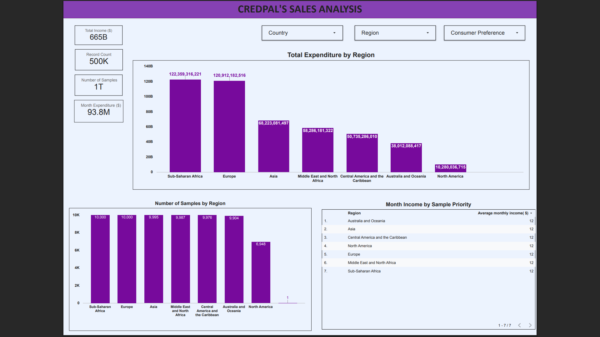
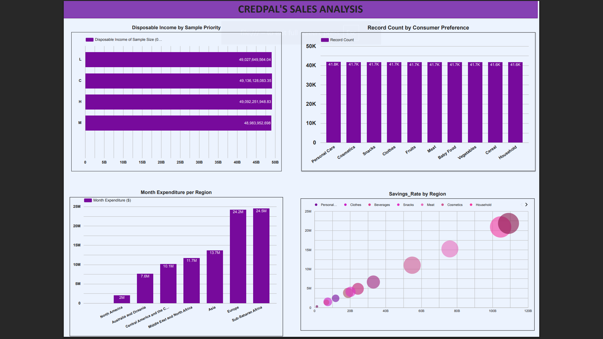
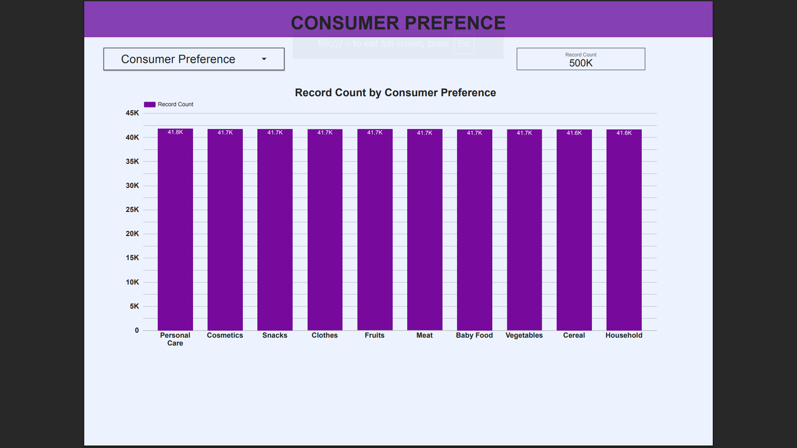

# Credpal_Analysis_LookerStudio
# 📊 CredPal Sales & Consumer Behavior Analysis

## 🚀 Project Overview
This project involves a comprehensive analysis of consumer income, expenditure, and spending habits across various global regions. Using **Looker Studio**, I developed an interactive dashboard to visualize financial behaviors within a dataset of **500,000 records**.

The goal was to identify high-value markets, understand spending priorities, and provide strategic recommendations to maximize revenue capture.

## 📋 Problem Statement
Analyze Credpal's credit performance data and create actionable business intelligence dashboards to understand customer credit patterns, defaults, and regional performance trends for better decision-making.

## 🎯 Approach
1. Data Collection: Gathered Credpal credit transaction and customer data
2. Data Analysis: Processed and analyzed credit metrics (defaults, categories, regional patterns)
3. Visualization: Built interactive dashboards in Google Looker Studio to visualize insights across multiple dimensions:
- Overview dashboard (overall credit metrics)
- Category-wise breakdown (loan/credit by type)
- Regional analysis (geographic performance)

## 🛠️ Tools Used
* **Data Visualization:** Google Looker Studio
* **Data Source:** CredPal Analysis Dataset

---

## 📸 Dashboard Visuals

### 1. Executive Overview
*A high-level view of the financial capacity within the dataset, tracking over $665 Billion in Total Income.*

### 2. Regional Expenditure Analysis
*Breakdown of spending power by region, identifying Sub-Saharan Africa and Europe as the leading markets.*

### 3. Category Performance
*Analysis of top spending categories, highlighting Meat, Office Supplies, and Household items as essential drivers.*

---

## 💡 Key Insights & Findings

Based on the analysis of **$93.8 Million in Monthly Expenditure**, the following trends were identified:

* **Top Performing Regions:** Sub-Saharan Africa and Europe recorded the highest total expenditures, indicating strong market activity in these zones.
* **Spending Habits:** Consumers prioritize essential goods. The top three spending categories are **Meat (86.4%)**, **Office Supplies (80.6%)**, and **Household Items (75.2%)**.
* **Financial Stability:** Savings rates are remarkably consistent across all regions, averaging roughly **29%**, which suggests stable financial discipline regardless of location.
* **B2B Potential:** The high expenditure on "Office Supplies" suggests a significant segment of the user base may be small businesses or remote workers.
* **Uniform Economic Capacity:** Analysis of sample priority groups (Low, High, Critical, Medium) revealed minimal variation in income and expenditure, suggesting a homogeneous economic profile across segments.

---

## 📈 Strategic Recommendations

1.  **Targeted Marketing:** Focus marketing budgets on high-engagement categories (Meat, Household, Office Supplies) to maximize ROI.
2.  **Regional Strategy:** Prioritize expansion and logistics investments in **Sub-Saharan Africa** and **Europe** to capitalize on their higher purchasing power.
3.  **B2B Investigation:** Further investigate the "Office Supplies" segment to develop specific B2B credit products or "Work-from-Home" packages.
4.  **Financial Literacy Products:** Since savings rates are stable but moderate (~29%), there is an opportunity to introduce investment or high-yield savings products to encourage wealth retention.
5.  **Diversification:** Create bundle offers to boost underperforming categories such as Baby Food and Cosmetics.

---

## 📄 Conclusion
The CredPal Analysis dashboard reveals a stable global market with a strong preference for essential and household goods. By leveraging the regional dominance of Europe and Sub-Saharan Africa, and tailoring products to the "Essentials" and "Office" categories, there is a clear path to increased revenue optimization.

---

*Author: Salome Kungu*
